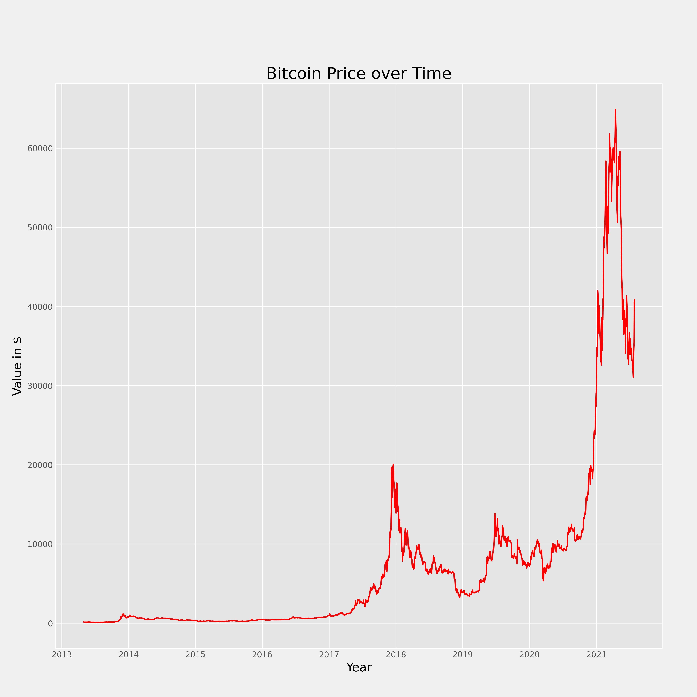

# time_series_analysis

# Table of Contents
___
### Notebooks
- [Exploratory Data Analysis](./notebooks/exploratory/EDA.ipynb)
- [Exploratory api functions](./notebooks/exploratory/get_data.ipynb)

### Example Images
 

# Introduction
___
This project aims to provide anaysis of Bitcoin and other cryptocurrencies using historical data available thorugh api queries.
Specifically, the focus is on time series analysis of Bitcoin using various methods and sources of data.
This is done by using Random walk as a baseline to show how the methods of Linear Regression, ARIMA, and LSTM compare when used on the same data set.
Future features will include TimeSeriesSplit cross validation and ARIMAX models.

